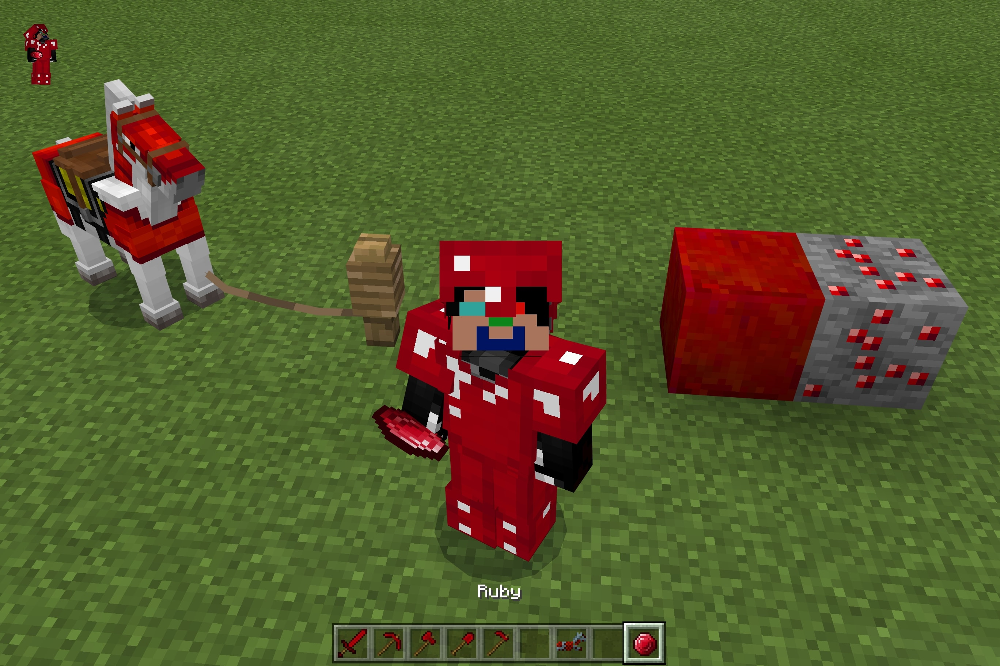

# Rubies

Rubies is a resource pack that replaces diamonds with rubies. At the moment, the following items have been replaced with their ruby counterparts:

- Diamond
- Diamond Block
- Diamond Ore
- Tools (Sword, Pickaxe, Axe, Shovel, Hoe)
- Armour (Player & Horse)

To use it, simply download and open the [`rubies.mcpack`](https://raw.githubusercontent.com/TheDragonRing/rubies/master/rubies.mcpack) file. If you wish for items/blocks to use the name "ruby" rather than "diamond", go into your language settings after loading the pack and select "English (RUBIES)".

_For Minecraft: Bedrock Edition (Windows 10, iOS, Android + more...)_

---

