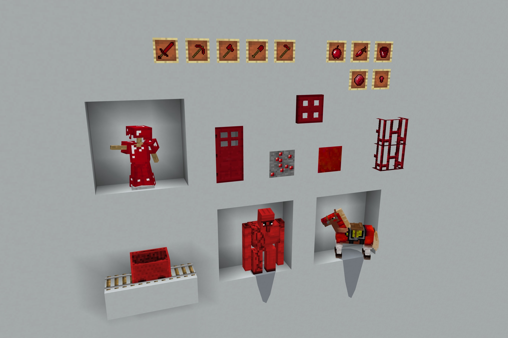

# Rubies

Rubies is a resource pack that adds rubies to the game. Using the pack settings resolution toggle in the game settings, you can choose which material to replace with rubies.

The following diamond/gold/iron items have been replaced with their ruby counterparts:

- Gem/Ingot
- Block
- Ore
- Tools (Sword, Pickaxe, Axe, Shovel, Hoe)
- Armour (Player & Horse)

The following extra gold items have been replaced with their ruby counterparts:

- Nugget
- Apple
- Carrot

The following extra iron items have been replaced with their ruby counterparts:

- Nugget
- Door + Trapdoor
- Bars
- Golem
- Minecart
- Bucket

The following chain items have been replaced with their ruby counterparts:

- Armour (Player)

The following emerald/lapis/redstone/coal items have been replaced with their ruby counterparts:

- Gem/Dust
- Block
- Ore

To use it, simply download and open the [`rubies.mcpack`](https://raw.githubusercontent.com/TheDragonRing/rubies/master/rubies.mcpack) file. If you wish for items/blocks to use the name "ruby", go into your language settings after loading the pack and select "English (RUBIES)".

_For Minecraft: Bedrock Edition (Windows 10, iOS, Android + more...)_

---

